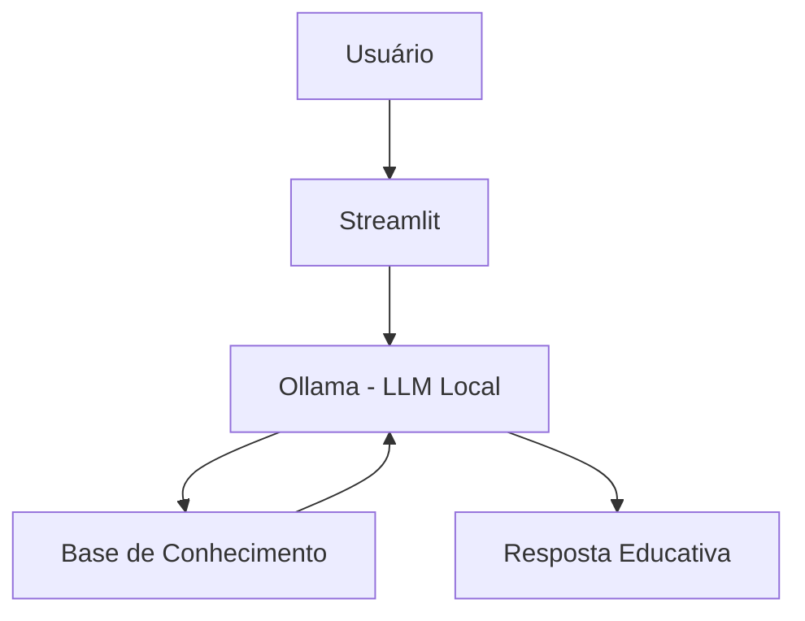

# 🎓 Maximizando - consultor financeiro

> Agente de IA Generativa que ensina e faz sugestão de acoes que ajuda nas melhores escolhas baseado em dados.

## 💡 O Que é o Max?

Max é um consultor finaceiro especialista em acoes que **ensina** e **recomenda apenas açoes** baseado em dados e estatisca. Ele demostra as melhores acoes e como podem esta o mercado ajundando na melhor escolha e explica o porque das escolhas.

**O que o Max faz:**
- ✅ Explica conceitos financeiros de forma simples
- ✅ Usa dados historicos
- ✅ Responde dúvidas sobre produtos financeiros
- ✅ compara acoes do mesmo setor
- ✅ Recomenda **apenas** acoes
- ✅ Faz demostraçoes com graficos

**O que o Max NÃO faz:**
- ❌ Não recomenda outros investimentos que não seja acoes
- ❌ Não acessa dados bancários sensíveis
- ❌ Não substitui um profissional certificado
- ❌ Não faz recomendacoes sem base de dados

## 🏗️ Arquitetura



**Stack:**
- Interface: Streamlit
- LLM: Ollama (modelo local `gpt-oss`)
- Dados: JSON/CSV mockados

## 📁 Estrutura do Projeto

```
├── data/                          # Base de conhecimento
│   ├── ibovespa.csv               # Histórico financeiro
│   ├── petrobras.csv              # Interações anteriores
│   └── produtos_financeiros.json  # Produtos para ensino
│
├── docs/                          # Documentação completa
│   ├── 01-documentacao-agente.md  # Caso de uso e persona
│   ├── 02-base-conhecimento.md    # Estratégia de dados
│   ├── 03-prompts.md              # System prompt e exemplos
│   ├── 04-metricas.md             # Avaliação de qualidade
│   └── 05-pitch.md                # Apresentação do projeto
│
└── src/
    └── app.py                     # Aplicação Streamlit
```

## 🚀 Como Executar

### 1. Instalar Ollama

```bash
# Baixar em: ollama.com
ollama pull gpt-oss
ollama serve
```

### 2. Instalar Dependências

```bash
pip install streamlit pandas requests
```

### 3. Rodar o Max

```bash
streamlit run src/app.py
```


## 📊 Métricas de Avaliação

| Métrica | Objetivo |
|---------|----------|
| **Assertividade** | O agente responde o que foi perguntado? |
| **Segurança** | Evita inventar informações (anti-alucinação)? |
| **Coerência** | A resposta baseada em dados |

## 🎬 Diferenciais

- **Personalização:** Usa os dados e estatitisca
- **100% Local:** Roda com Ollama, sem enviar dados para APIs externas
- **Educativo:** Foco em recomendar as melhores acoes
- **Seguro:** Estratégias de anti-alucinação documentadas

## 📝 Documentação Completa

Toda a documentação técnica, estratégias de prompt e casos de teste estão disponíveis na pasta [`docs/`](./docs/).
